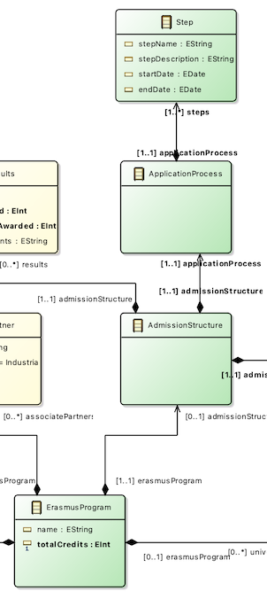

# A5-sirius-and-xtext
The assignment focuses on the development of textual and graphical editors related to the identified domain. It requires the realization of several tasks by using the following frameworks: xText - Sirius.
The assignment aims to understand the acquired competencies about the considered technologies. Because of the complexity of such technologies, we are asking for straightforward editor implementations that partially cover the concepts defined at the metamodel level.

## Task A4.1
Define a complete concrete syntax for the metamodel defined in A2 by using xText. The concrete syntax should cover all the concepts defined at the metamodel level.
Suggestion: feel free to reuse and refine the default concrete syntax provided by xText wizard.

__*Solution*__: to see this implementation in action, import all 5 of these projects:
- org.xtext.mde.a5
- org.xtext.mde.a5.ide
- org.xtext.mde.a5.tests
- org.xtext.mde.a5.ui
- org.xtext.mde.a5.ui.tests

run project org.xtext.mde.a5 as an Eclipse application, and create a file with the .erasmus extension.  
A sample file is provided here: [EDISS.erasmus](EDISS.erasmus).

## Task A4.2
Define a straightforward graphical editor to visualize and edit your domain models by using Sirius. In this task, we ask for a dummy graphical editor that partially covers your domain metamodel concepts. In other words, the graphical editor should provide the representations for some metamodel concepts and the involved relations. Try to include at least the following Sirius features:
- Node representations,
- Edge representations (both relation-based and element-based), and
- Palette operators to create such nodes and edges.

__*Solution*__: this task has been implemented in project [mde.a5.design](mde.a5.design). The editor covers only this section of our metamodel (classes in green):

The editor implements the following features:
- Node representations: the ErasmusProgram, ApplicationProcess and Step concepts are represented as nodes
- Edge representations: the AdmissionStructure concept is represented as an edge between the ErasmusProgram and ApplicationProcess nodes. Also, the relation between ApplicationProcess and Step is represented as edges between the corresponding nodes
- Palette operators: two palette actions have been implemented: to create an ApplicationProcess node, and to create several Step nodes. Since the model only allows the existence of a single ApplicationProcess associated to the ErasmusProgram, there is a precondition on the Create Application Process action to prevent the creation of such a node when an ApplicationProcess instance already exists in the model. Also, the Create Application Process action creates the corresponding AdmissionStructure instance linked to the ErasmusProgram if it doesn't exist yet.

To create a model that can be edited with the diagram editor, the projects from assignment 3 are required to be in the same workspace; those projects can be found here: https://github.com/MDE-Course-23-24/a3-emf-and-ocl-l-erasmo-stanco.
